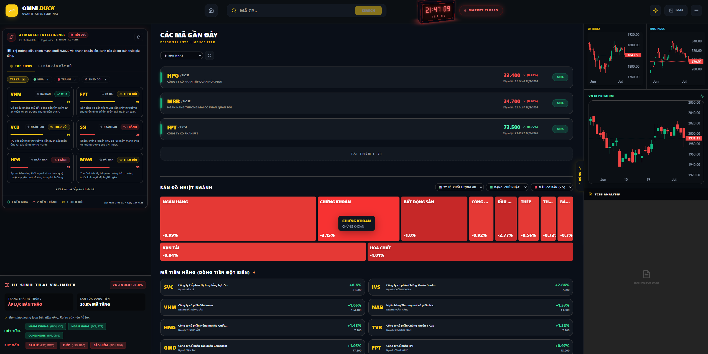
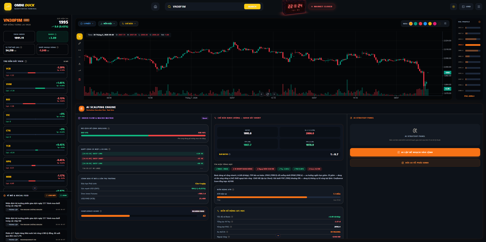
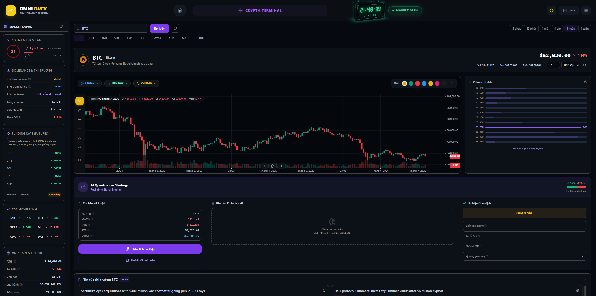
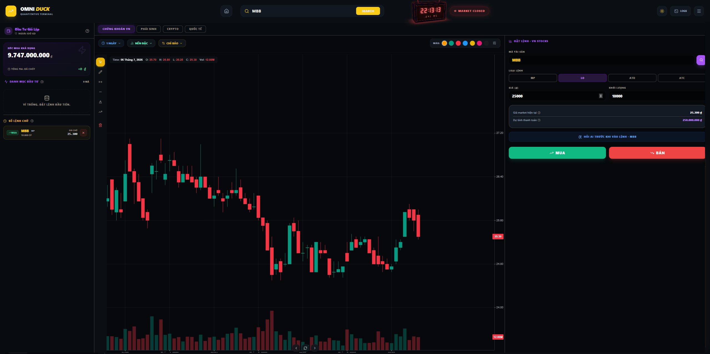
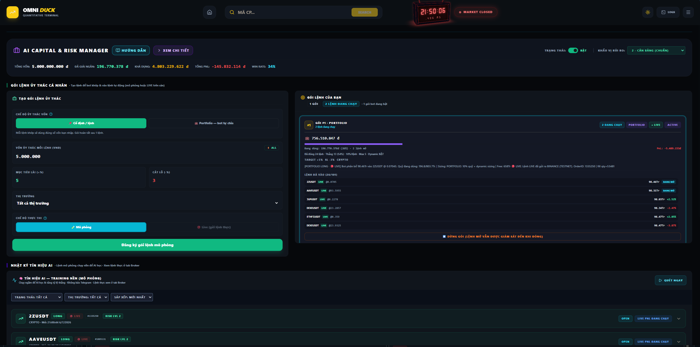
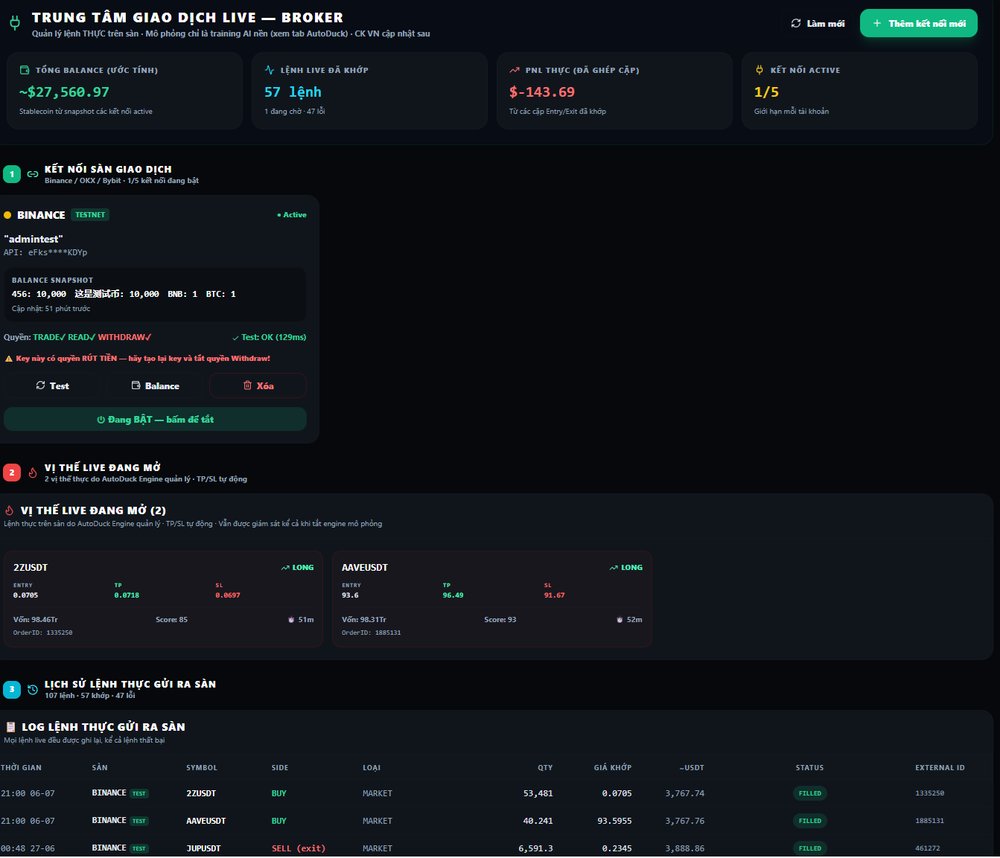
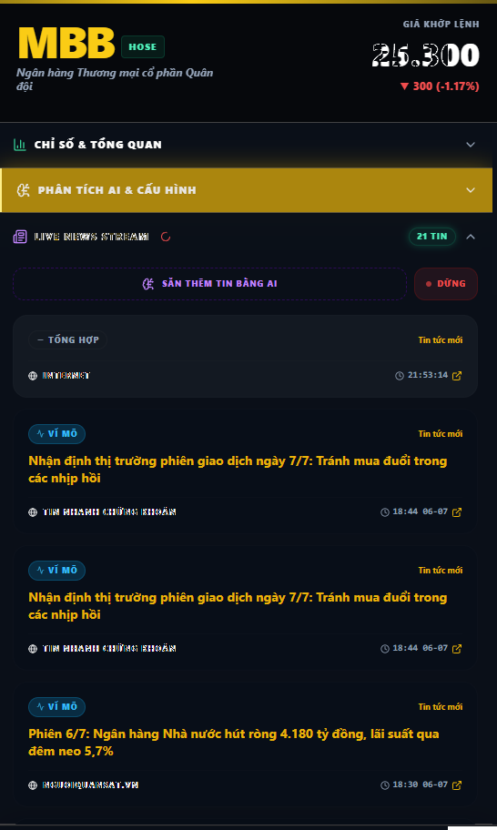
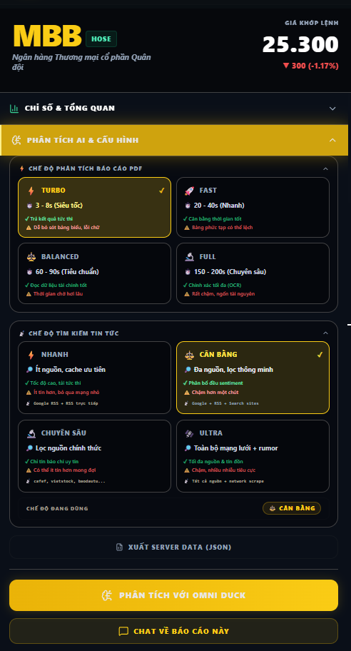
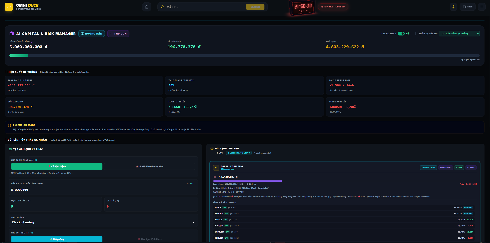
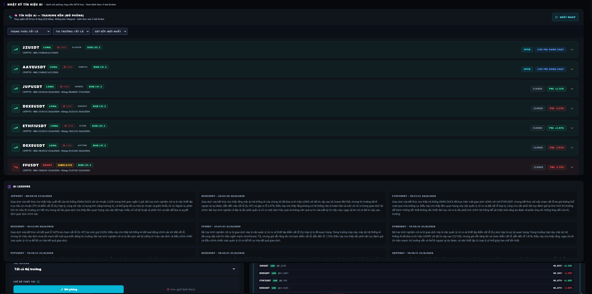

<div align="center">


# OMNI DUCK - Vnstock Finance Agent
### Quantitative Finance Terminal — Vietnam & Global Markets

[](https://nodejs.org)
[](https://react.dev)
[](https://mongodb.com)
[](https://aistudio.google.com)
[]()

**AI-Powered Trading & Analysis Platform for Vietnamese Stocks, Derivatives & Cryptocurrency**

🇻🇳 [Đọc bản tiếng Việt](README.vi.md)

[Quick Start](#-quick-start) · [Visual Tour](#-visual-tour) · [Tabs](#-tabs-guide) · [Features](#-core-features) · [AI System](#-ai-system) · [Configuration](#%EF%B8%8F-environment-configuration)

</div>

---

## 📋 Table of Contents

1. [Visual Tour](#-visual-tour)
2. [Overview](#-overview)
3. [Quick Start](#-quick-start)
4. [Tabs Guide](#-tabs-guide)
5. [Core Features](#-core-features)
6. [AI System](#-ai-system)
7. [Architecture](#%EF%B8%8F-system-architecture)
8. [Environment Configuration](#%EF%B8%8F-environment-configuration)
9. [API Endpoints](#-api-endpoints)
10. [Project Structure](#-project-structure)
11. [Optional CLI](#-optional-cli)
12. [Roadmap](#%EF%B8%8F-roadmap)
13. [Disclaimer](#%EF%B8%8F-disclaimer)

---

## 📸 Visual Tour

<details open>
<summary><b>App screenshots</b> — 6 main tabs at a glance (click to collapse)</summary>

<table>
<tr>
<td align="center"><b>1. VN Stocks</b><br/></td>
<td align="center"><b>2. Derivatives</b><br/></td>
<td align="center"><b>3. Crypto</b><br/></td>
</tr>
<tr>
<td align="center"><b>5. Paper Trading</b><br/></td>
<td align="center"><b>6. Auto Duck</b><br/></td>
<td align="center"><b>7. Broker</b><br/></td>
</tr>
</table>

<details>
<summary><b>VN Stocks</b> — 3 views (overview · news · AI config)</summary>

<table>
<tr>
<td align="center"><b>Market overview</b><br/></td>
<td align="center"><b>Live news stream</b><br/></td>
<td align="center"><b>AI & PDF config</b><br/></td>
</tr>
</table>

</details>

<details>
<summary><b>Auto Duck</b> — 3 views (capital · performance · signal log)</summary>

<table>
<tr>
<td align="center"><b>Capital & packages</b><br/></td>
<td align="center"><b>System performance</b><br/></td>
<td align="center"><b>AI signal log & lessons</b><br/></td>
</tr>
</table>

</details>

</details>

---

## 🎯 Overview

**OMNI DUCK** is a full-stack AI-powered quantitative finance terminal built for the Vietnamese market, with global crypto and derivatives coverage. It combines real-time scraping from 10+ Vietnamese financial sources, a multi-provider AI routing engine, a multi-phase debate analysis pipeline, automated trading with technical indicators, and a React dashboard — all in a unified self-hosted stack.

*This personalized system is built for immediate investment workflows; feedback and contributions are welcome.*

| Module | Status | Notes |
|--------|--------|-------|
| 📰 VN News Scraping | ✅ Strong | 5 direct RSS + Google News multi-query, Vietnamese sentiment NLP |
| 📈 VN Stock Analysis | ✅ Strong | VNDirect, TCBS, CafeF, VNstock-py, FireAnt social |
| 🤖 AI Debate Pipeline | ✅ Strong | Multi-phase Bull/Bear/PM decision engine |
| 🔴 Derivatives | ✅ Working | VN30F1M, macro news, AI analysis |
| 🎮 Paper Trading | ✅ Working | Virtual 10B VND, LO/ATO/ATC orders, P&L |
| 🔌 Broker / Live Trading | ✅ Working | Binance, OKX, Bybit (crypto) + DNSE (VN stocks) — testnet & live |
| 🪙 Crypto | ⚠️ Developing | CoinGecko/Binance data, limited signals |
| 📊 Charts | ⚠️ Developing | KlineCharts + Lightweight Charts, UX ongoing |
| 🔄 AutoTrading | ⚠️ Improving | Win-rate tuning, AI lessons, simulation + LIVE modes |

**Auth:** Register / login per user (MongoDB). Settings and portfolios are scoped to the logged-in username.

---

## 🚀 Quick Start

### Prerequisites

| Requirement | Notes |
|-------------|-------|
| Node.js ≥ 22.15, npm ≥ 9 | Backend needs `--use-system-ca` (Node ≥ 22.15); frontend same toolchain |
| MongoDB | Local or [Atlas](https://cloud.mongodb.com) free tier — **required to boot** |
| Python 3.10+ | Optional — only for TCBS PDF parsing (`Convertpdf/`) |
| Gemini API key | [aistudio.google.com](https://aistudio.google.com/app/apikey) — recommended for AI features |
| Groq API key | [console.groq.com](https://console.groq.com) — recommended fallback |

### Install & run

```bash
# 1. Clone & install
git clone https://github.com/bigbaboi2/VNstock-Finance-Agent.git
cd VNstock-Finance-Agent
npm install
cd frontend && npm install --legacy-peer-deps && cd ..

# 2. Environment — copy template and set MongoDB
cp .env.example.en .env
# Required to boot: MONGODB_URI  (e.g. mongodb://127.0.0.1:27017/omniduck)
# Recommended for AI: GEMINI_API_KEY_MAIN, GROQ_API_KEY
# Without AI keys the server still starts; only analysis features degrade.

# Terminal 1 — Backend (port 3001)
npm run dev:backend

# Terminal 2 — Frontend (port 5173)
cd frontend && npm run dev

# Optional — PDF parser (port 8000, only for TCBS report analysis)
cd Convertpdf && python Convertpdf.py
```

Open **http://localhost:5173** → register a user → explore tabs from the menu (top-right).

> Frontend install must use `--legacy-peer-deps` (recharts peer range vs React 19). Paid API tiers are optional but improve rate limits for heavy use.

---

## 🗂️ Tabs Guide

The UI exposes **7 tabs** from the user menu (tab 4 is disabled — coming soon).

| # | Tab | What you get | Screenshot |
|---|-----|--------------|------------|
| 1 | **VN Stocks** | Real-time quotes (VNDirect, TCBS, CafeF), sector heatmap, AI market intel, debate analysis, KlineCharts, floating `StockAiChat` | [overview](docs/screenshots/vn-stock-overview.png) · [news](docs/screenshots/vn-stock-news.png) · [config](docs/screenshots/vn-stock-ai-config.png) |
| 2 | **Derivatives** | VN30F1M / HNX futures, macro news, mechanical signal + confluence score, AI deriv analysis (DXY, Dow, USD/VND) | [deriv](docs/screenshots/deriv.png) |
| 3 | **Crypto** | CoinGecko/Binance prices, funding, fear & greed, multi-timeframe charts, AI signal engine | [crypto](docs/screenshots/crypto.png) |
| 4 | **International** | *Coming soon* — disabled in UI | — |
| 5 | **Paper Trading** | Virtual 10B VND portfolio, LO/ATO/ATC, multi-asset P&L | [paper-trading](docs/screenshots/paper-trading.png) |
| 6 | **Auto Duck** | Scheduler pipeline (crypto 24/7, VN 15 min), risk levels 1–4, simulation vs LIVE execution, AI lessons | [1](docs/screenshots/autotrade-1.png) · [2](docs/screenshots/autotrade-2.png) · [3](docs/screenshots/autotrade-3.png) |
| 7 | **Broker** | Connect exchange APIs (Binance/OKX/Bybit crypto + DNSE VN stocks), live positions, order history, balance sync, permission warnings | [broker](docs/screenshots/broker.png) |

**Auto Duck pipeline (simplified):**

```
startAutoDuckScheduler() → runAutoTradePipeline()
  → Fetch context → Build universe → Analyze (OHLCV + tech + news + AI) → Execute / Exit
```

Simulation orders run in the background for AI learning; real exchange orders appear in the **Broker** tab when LIVE mode and an active TRADE connection are configured.

---

## ✨ Core Features

### 📰 Vietnamese News Intelligence *(strongest module)*

**Direct RSS (always-on, market-hours TTL):** VietStock, CafeF, VnEconomy, BaoDauTu, TinNhanhChungKhoan.

**UI news modes** (user-selectable in VN Stocks tab):

| Mode | Key | Speed | Trade-off |
|------|-----|-------|-----------|
| NHANH | `fast` | Highest | Fewer sources, cache-first |
| CÂN BẰNG | `balanced` | Balanced | Google + RSS + search sites (default) |
| CHUYÊN SÂU | `deep` | Slower | Official / reputable sources only |
| ULTRA | `ultra` | Slowest | All sources incl. rumors — more noise |

**Backend Google query strategies** (per ticker, inside search engine):

| Mode | Window | Purpose |
|------|--------|---------|
| `official` | 90 days | Disclosures, financials |
| `balanced` | 60 days | General market news |
| `negative` | 30 days | Sell-offs, violations |
| `rumor` | 21 days | Unusual volume, insider activity |

**Also included:** Vietnamese keyword sentiment (no English-only VADER), 100+ ticker alias expansion, FireAnt social sentiment (requires `FIREANT_TOKEN` in `.env`).

---

### 📄 PDF Docling System

TCBS daily reports: `https://static.tcbs.com.vn/oneclick/{TICKER}.pdf` → Python FastAPI `:8000/parse-pdf` → Markdown → AI fundamental analyst.

| Mode | OCR | ML | Speed | Use case |
|------|-----|----|-------|----------|
| **turbo** (default) | ❌ | ❌ | ~3–8s | Text-based PDFs (99% of reports) |
| **fast** | ❌ | ✅ | ~20–40s | Table extraction |
| **balanced** | ❌ | ✅ | ~60–90s | Complex financial tables |
| **full** | ✅ | ✅ | ~150–200s | Scanned / photo PDFs |

---

### ✈️ Telegram

- News groups/channels as an extra source; AI-filtered before Auto Duck
- Admin alerts: provider downtime, volatile stocks, order results

| Command | Description |
|---------|-------------|
| `/check` | Capital, open orders, 30-day win rate |
| `/stop` | Lock pipeline (monitor existing orders) |
| `/start` | Unlock pipeline |
| `/help` | Command list |

---

## 🤖 AI System

### Multi-Provider Router

`multiProviderRouter.js` assigns each analytical role a priority chain with exponential backoff on 429/503. Telegram alerts on repeated failures.

| Role | Priority chain |
|------|----------------|
| main | Gemini Pro → Gemini Flash → Groq → Cerebras |
| tech | Groq → Cerebras → SambaNova → Gemini Flash |
| fundamental | Cerebras → SambaNova → Groq → Gemini Flash |
| news | SambaNova → Groq → DeepInfra → Gemini Flash |
| bull | Groq → Cerebras → OpenRouter → Gemini Flash |
| bear | SambaNova → Groq → Gemini Flash |
| pm | Groq → Cerebras → Gemini Flash → Gemini Pro |
| derivatives | Gemini Pro → Gemini Flash → Groq |
| crypto / chat | Groq → Gemini Flash → Cerebras |
| json / action | Gemini Flash → Groq → Cerebras |

Gemini models are discovered dynamically at runtime (prefer newer + Pro). Offline fallback list: `2.5-flash` → `2.5-flash-lite` → `2.5-pro` → `1.5-pro`.

---

### 🏦 Debate Pipeline (`hedgeFundEngine.js`)

For any VN ticker, a structured multi-phase debate runs in parallel then sequential phases:

1. **Phase 1 — Independent analysts (parallel):** Tech · Fundamental (PDF-aware) · Sentiment
2. **Phase 2 — Bull vs Bear:** Opening → Rebuttal → Final defense
3. **Phase 3 — Portfolio Manager:** Rating `MUA MẠNH / MUA / NẮM GIỮ / GIẢM / BÁN / TRÁNH` + entry, SL, targets, horizon, conviction
4. **Action panel:** Gemini Flash extracts structured JSON for the UI trade panel

---

### 📊 Market Intelligence (`quantEngine.js`)

- Market breadth (Entrade → TCBS fallback)
- Sector Power Score (SPS) with dynamic thresholds
- Foreign flow from CafeF scraper
- Verdict: Bull / Bear / Trap / Accumulation vs Distribution

---

## 🏗️ System Architecture

```
┌─────────────────────────────────────────────────────────────────┐
│  FRONTEND  React 19 + Vite + Tailwind                           │
│  VnStocksTab │ DerivativesTab │ CryptoTab │ PaperTradingTab       │
│  AutoDuckTab │ BrokerConnectionTab │ StockAiChat │ Charts         │
└────────────────────────────┬────────────────────────────────────┘
                             │  REST / SSE  (port 3001)
                             ▼
┌─────────────────────────────────────────────────────────────────┐
│  BACKEND  Node.js 22.15+ · Express 5                            │
│  multiProviderRouter │ hedgeFundEngine │ quantEngine            │
│  autoTradeEngine │ exchangeBrokerService │ telegramService      │
│  Scrapers: vnNewsSearch, cafefMarketScraper, contentScraper       │
└──────────────┬──────────────────────┬───────────────────────────┘
               ▼                      ▼
          MongoDB Atlas          External APIs + Python :8000
          (Mongoose models)    VNDirect, TCBS, Binance, DNSE, FireAnt…
```

| Layer | Stack |
|-------|-------|
| Frontend | React 19, Vite 8, Tailwind 3, KlineCharts, Lightweight Charts |
| Backend | Node 22.15+, Express 5, Mongoose 9 |
| AI | Gemini, Groq, Cerebras, SambaNova, DeepInfra, OpenRouter |
| Ops | PM2 / nodemon, Telegram Bot API |

---

## ⚙️ Environment Configuration

All **bootstrap / secrets** live in **one root `.env`** (Vite proxies `/api` → `localhost:3001`; no separate frontend `.env` required for local dev).

**AutoTrade knobs:** in-app (**Auto Duck → Cấu hình AutoTrade**, admin). Defaults in code; overrides in MongoDB `Setting`.

**Templates:** [`.env.example.en`](.env.example.en) (English) · [`.env.example`](.env.example) (Vietnamese)

| Group | Key variables | Required |
|-------|---------------|----------|
| Core | `MONGODB_URI` | ✅ (boot) |
| AI | `GEMINI_API_KEY_MAIN` (+ optional `GEMINI_API_KEY_ACTION` / `_INSIGHT`) | Recommended |
| AI fallbacks | `GROQ_API_KEY`, `CEREBRAS_API_KEY`, `SAMBANOVA_API_KEY`, `DEEPINFRA_API_KEY`, `OPENROUTER_API_KEY`, `MISTRAL_API_KEY` | Recommended |
| Market data | `FIREANT_TOKEN`, `COINGLASS_API_KEY` | Optional |
| Telegram | `TELEGRAM_BOT_TOKEN`, `TELEGRAM_CHAT_ID`, `TELEGRAM_ADMIN_CHAT_ID`, `WEBHOOK_BASE_URL` | Optional |
| Security | `EXTERNAL_SIGNAL_SECRET`, `ADMIN_RESET_KEY`, `ADMIN_CODE`, `ENCRYPTION_KEY` | Production |
| Frontend | `VITE_API_BASE_URL`, `VITE_AI_PRICE_SIGNIFICANT_THRESHOLD` | Optional |
| AutoTrade | UI: Auto Duck → Cấu hình AutoTrade | Admin |

> Backend hardcodes `PORT=3001` in `server.js`. Variables like `PORT`, `JWT_SECRET`, `REDIS_*` are **not** read from `.env` in the current code. Empty AI provider keys are skipped by the multi-provider router.

---

## 📡 API Endpoints

<details>
<summary><b>Click to expand full endpoint list</b></summary>

**Auth**
- `POST /api/auth/register` · `POST /api/auth/login`

**Market**
- `GET /api/market/symbols` · `GET /api/market/heatmap` · `GET /api/market/radar`
- `GET /api/market-insight/today` · `GET /api/market-insight/history`

**Stock & AI**
- `GET /api/market/info/:ticker`
- `POST /api/ai/analyze/:ticker` · `POST /api/ai/analyze/:ticker/stream` (SSE debate)
- `GET /api/ai/news/:ticker` · `POST /api/ai/stock-chat/:ticker`
- `POST /api/ai/analyze-derivatives` · `POST /api/ai/action-panel/:ticker`

**Derivatives**
- `GET /api/derivatives/radar` · `GET /api/derivatives/news` · `POST /api/derivatives/news/refresh`

**Crypto**
- `GET /api/crypto/symbols` · `GET /api/crypto/price/:symbol` · `GET /api/crypto/radar`
- `GET /api/crypto/funding` · `GET /api/crypto/liquidations` · `POST /api/crypto/signal`

**Paper trading**
- `GET /api/portfolio/:username` · `POST /api/portfolio/trade` · `POST /api/portfolio/cancel-order`

**Auto Duck**
- `GET /api/auto-trade/settings` · `POST /api/auto-trade/settings`
- `GET /api/auto-trade/env-config` · `POST /api/auto-trade/env-config`
- `GET /api/auto-trade/user-order/:username` · `POST /api/auto-trade/user-order`
- `GET /api/auto-trade/ai-lessons` · `GET /api/auto-trade/pipeline-logs`
- `POST /api/auto-trade/force-trigger`

**Broker / exchange**
- `GET /api/exchange-connections/:username` · `POST /api/exchange-connections`
- `POST /api/exchange-connections/:id/test` · `GET /api/exchange-connections/:id/balance`
- `GET /api/exchange-connections/orders/:username`

**Telegram admin**
- `POST /api/telegram/webhook` · `GET /api/telegram/set-webhook`

</details>

---

## 📁 Project Structure

```
ProjectFinance/
├── src/
│   ├── server.js
│   ├── controllers/          # Route handlers
│   ├── routes/
│   ├── services/             # aiService, hedgeFundEngine, autoTradeEngine, exchangeBrokerService…
│   ├── scrapers/             # vnNewsSearch, cafefMarketScraper…
│   ├── fetchers/
│   └── jobs/                 # newsCron, cryptoUpdater…
├── models/                   # Mongoose schemas (User, UserOrder, AutoTrade…)
├── frontend/src/components/  # Tab components + charts
├── cli/                      # Terminal UI (omni-cli.js)
├── Convertpdf/               # Optional Python FastAPI PDF parser (:8000)
├── docs/screenshots/         # README gallery images
├── .env.example.en
└── omni-manager.bat          # Windows quick launcher
```

> Local `scripts/` (diag / test helpers) is gitignored and not shipped with the repo.

---

## 💻 Optional CLI

Terminal UI alternative to the React dashboard — VN stocks, derivatives, and crypto.

```bash
# From project root
node cli/omni-cli.js

# Or on Windows: double-click omni-manager.bat
```

---

## 🗺️ Roadmap

**High priority**
- [ ] Chart performance — KlineCharts latency, drag/freeze edge cases
- [ ] Crypto — stronger signals, cross-exchange data
- [ ] UI/UX — skeletons, mobile, chart toolbar
- [ ] Auto-trade win rate — ADX, VWAP, OBV, Stoch RSI
- [ ] International markets tab (currently disabled in UI)

**Medium**
- [ ] Redis caching · DB indexing · bcrypt passwords · Jest unit tests · WebSocket prices

**Planned**
- [ ] E2E tests · Docker Compose · public watchlists · React Native app

---

## ⚠️ Disclaimer

> **OMNI DUCK is a research and educational platform — not financial advice.**

All analysis, signals, AI reports, and recommendations are for **informational and learning purposes only**. Authors and contributors are **not liable** for financial losses. Market data and AI output may contain errors or delays. Users are solely responsible for trading decisions.

Trading stocks, derivatives, and cryptocurrencies involves substantial risk. Past performance does not guarantee future results.

**Use this software entirely at your own risk.** Consult a licensed financial professional before investing.

---

<div align="center">

**OMNI DUCK** — Built for the Vietnamese trading community and global market watchers.

[⭐ Star on GitHub](https://github.com/bigbaboi2/VNstock-Finance-Agent) · [🐛 Report Bug](https://github.com/bigbaboi2/VNstock-Finance-Agent/issues) · [💡 Request Feature](https://github.com/bigbaboi2/VNstock-Finance-Agent/discussions)

**Version:** 1.0.0 · **Status:** Active Development · **License:** Non-commercial use

</div>
